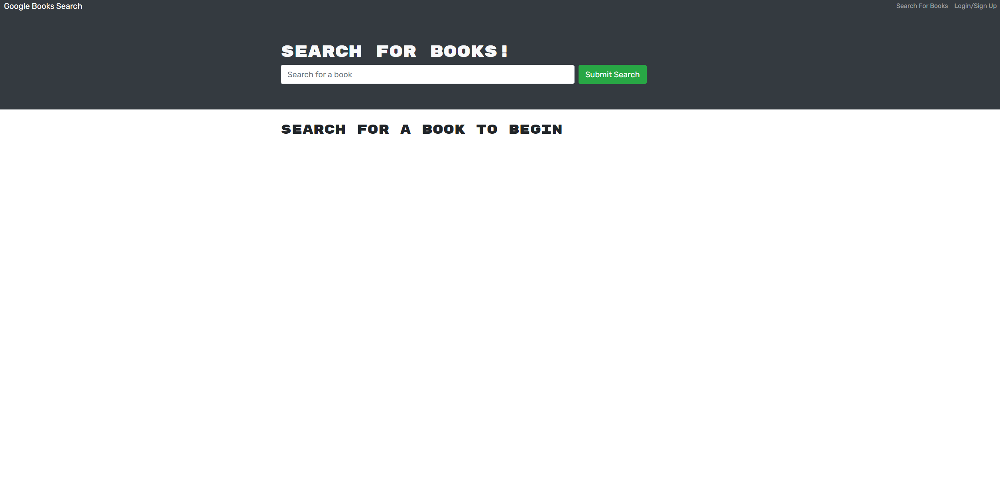
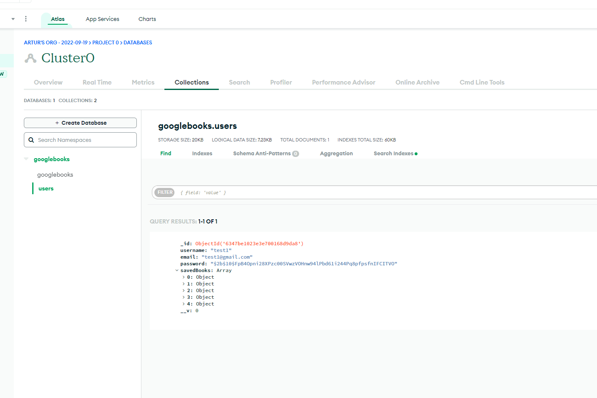

# Book Search

## Description

- Usage of Google Books API to create an `Graphql API` with `Apollo Server`.
  -The application is built using the `MERN` stack - `MongoDB`, `Express`, `React`, `Node`
- Giving users ability to sign up and search for books and save them.
- On a diferent page users can see their saved books and remove them from list.

## Table of Contents

- [Installation](#installation)
- [Usage](#usage)
- [License](#license)
- [Contributing](#contributing)
- [Tests](#tests)
- [Demo](#demo)
- [Screenshot](#screenshot)
- [Questions](#questions)

## Installation

- Clone repository to use this application on your local machine.
- `Node.js` is required.
- Install necessary dependencies by running `npm install`

## Usage

- Once everything has been installed run `npm run develoop` in the root folder.
- The application will start and you can navigate between pages and explore my portfolio

## License

This project is licensed under 

## Contributing

- N/A

## Tests

- N/A

## Demo

- Please follow this [link](https://bk-searcher.herokuapp.com) to visit the deployed application on Heroku.

## Screenshot

- Please see the screenshots below.

## Questions

If you have any questions regarding the project you can contact me directly at artlil420@gmail.com.
Please feel free to view more of my projects at https://github.com/Artur0705
